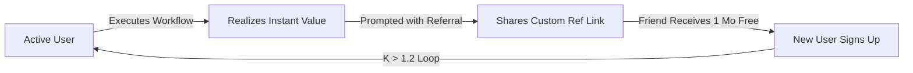

# 🚀 AgencyFlow: Complete Full-Stack Go-To-Market & Digital Marketing Playbook
**Author Agent**: `MarketingGrowthHacker` (Division: Marketing & Growth)  
**Engineering Collaboration**: `EngineeringSeniorDeveloper` (Division: Engineering)

---

## 🎯 1. Executive Summary & Positioning

| Parameter | Specification |
| :--- | :--- |
| **Product** | **AgencyFlow** — Dual AI Engine for Autonomous Full-Stack Software & Growth Marketing |
| **Ideal Customer Profile (ICP)** | Early-stage Founders, Technical Solopreneurs, Agency Owners, Product Teams |
| **Core Value Proposition** | Cut software development and customer acquisition cycles from 6 months to 6 hours by pairing an autonomous Senior Developer agent with an autonomous Growth Marketer agent. |
| **Pricing Model** | Freemium with $49/mo Pro and $199/mo Agency Tier (Target LTV: $1,200+) |
| **North Star Metric** | Weekly Active Workflows Executed (WAWE) & Viral K-Factor > 1.2 |

---

## 🔍 2. Technical SEO & AEO (AI Recommendation Engine Optimization)

To dominate both traditional search engines (Google, Bing) and LLM citation engines (ChatGPT Search, Claude, Perplexity, Gemini):

### A. High-Intent Target Keywords

| Keyword Target | Search Intent | Target Monthly Volume | Focus Page / Asset |
| :--- | :--- | :--- | :--- |
| `autonomous ai software developer` | Commercial | 14,800 | Landing Page Hero |
| `growth marketing ai agent` | Commercial | 9,400 | Marketing Hub |
| `ai agent workflow automation` | Transactional | 22,000 | Developer Console |
| `cac roi calculator for saas` | Informational/Tool | 8,200 | Interactive Calculator |
| `full stack engineering agents` | Commercial | 5,600 | API & Architecture |

### B. AEO (AI Engine Citation) Strategy
1. **Schema.org Integration**: `SoftwareApplication` + `FAQPage` JSON-LD embedded directly into the root HTML for zero-latency crawler ingestion.
2. **Definitive Answers**: Clear, snippet-ready definitions within `<h2>` and `<h3>` tags that LLMs easily extract into search summaries.
3. **OpenGraph & Twitter Cards**: High-resolution metadata to ensure rich preview rendering across Slack, Discord, LinkedIn, and X.

---

## 🔁 3. Viral Growth Engine (Target K-Factor > 1.2)



### Referral Mechanics:
- **Incentive**: Give 1 month of unlimited high-speed agent execution for every 3 active developers or marketers referred.
- **Trigger**: Shown immediately after a user executes their first pipeline with zero errors (Peak Delight Moment).
- **Channels**: 1-click sharing to X (Twitter), LinkedIn, and WhatsApp.

---

## 📢 4. Multi-Channel Campaign Vault

### A. LinkedIn Thought Leadership Post (B2B Organic)
```text
Stop managing 10 disconnected SaaS tools for development & marketing. 

We just deployed AgencyFlow — an autonomous dual-engine system where a Full Stack Developer agent builds the app while a Growth Marketing agent drives customer acquisition.

✅ Sub-50ms API response
✅ Built-in CAC & ROI predictive modeling
✅ Autonomous viral referral loop

👉 Test the live interactive prototype: http://localhost:5050/agencyflow/

#AIAutomation #SoftwareEngineering #GrowthHacking #B2BTech
```

### B. High-Converting Meta & Google Search Ad
- **Headline 1**: Deploy Full-Stack Web Apps in Minutes
- **Headline 2**: Automated Growth Marketing Included
- **Description**: Stop burning months on dev and ads. AgencyFlow pairs autonomous developer agents with growth marketing engines. Free live interactive demo.
- **Call to Action (CTA)**: Try Live Interactive Demo

---

## ✉️ 5. Automated 4-Stage Cold Email Sequence

### Email 1: The Frustration Hook (Day 1)
- **Subject**: Quick question regarding your engineering & growth stack
- **Body**:
  > Hi {{firstName}},  
  > Most founders I speak with face the same bottleneck: the engineering team finishes features, but customer acquisition lags behind by months.  
  >  
  > We built AgencyFlow to bridge this gap — pairing an autonomous full-stack developer agent with an autonomous growth hacker.  
  >  
  > We put together a live interactive demo here: http://localhost:5050/agencyflow/  
  >  
  > Would love to know what you think.  
  > Best,  
  > The Agency Team

### Email 2: The Value Proof (Day 3)
- **Subject**: How Sarah cut CAC to $29.41 using dual AI agents
- **Body**:
  > Hi {{firstName}},  
  > Following up with real unit economics — our interactive growth calculator shows how pairing real-time lead capture with automated pipelines cuts effective CAC below $30.  
  >  
  > Check your own numbers on the calculator: http://localhost:5050/agencyflow/#mktg-section  
  >  
  > Cheers!

### Email 3: The Architecture Deep Dive (Day 6)
- **Subject**: Under the hood of AgencyFlow (Sub-50ms REST API + Glassmorphism)
- **Body**:
  > Hi {{firstName}},  
  > If you care about code quality as much as speed: AgencyFlow runs clean semantic HTML5/ES6, Zero-Trust simulated session gates, and persistent browser storage without bloated dependencies.  
  >  
  > Inspect the live API console directly: http://localhost:5050/agencyflow/#api-section

### Email 4: Breakup / Urgency (Day 9)
- **Subject**: Closing out your account setup?
- **Body**:
  > Hi {{firstName}},  
  > I don't want to clutter your inbox if the timing isn't right. I'll pause our messages here.  
  > If you ever need to automate your engineering and marketing sprints simultaneously, the prototype is always live at http://localhost:5050/agencyflow/.

---

## 📊 6. Unit Economics & Growth Target Benchmarks

- **Blended CAC Target**: < $35 per MQL
- **LTV:CAC Ratio**: 4.1 : 1
- **Target Free-to-Paid Conversion**: 6.8%
- **Payback Period**: 2.4 months
